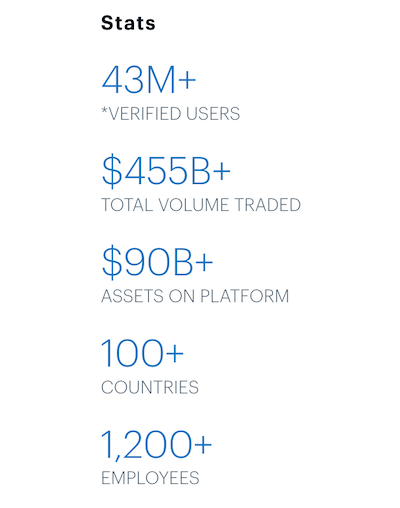

# How Coinbase is helping to create an open financial system - A Case Study

## Overview and Origin
In the past decade, [cryptocurrencies](https://en.wikipedia.org/wiki/Cryptocurrency) have gained significant attention worldwide. Since the inception of the first
cryptocurrency Bitcoin in 2008, many companies have been founded around this new technology. A cryptocurrency is a digital asset used as a medium of exchange and
is accompanied by a computerized ledger which stores records of ownership and transactions. Most of these ledgers use blockchain as the underlying technology to
permanently record the transactions between two parties efficiently and in a verifiable way. A [blockchain](https://en.wikipedia.org/wiki/Blockchain) is a growing
list of records, called blocks, and are chained together by the use of strong [cryptography](https://en.wikipedia.org/wiki/Cryptography). The Bitcoin blockchain,
for example, contains a record of every time someone sent or received a bitcoin. Almost all cryptocurrencies, including Bitcoin, Ethereum, Bitcoin Cash, and
Litecoin, are secured via blockchain networks, which means their accuracy is constantly being verified by a huge amount of computing power. Due to the
cryptographic nature of these networks, payments via blockchain can be more secure than standard debit/credit card transactions. The term distributed is used to
describe the architecture of the blockchain ledger, which is distributed across many computers in a peer-to-peer network and hence is decentralized by nature.

Cryptocurrencies, such as bitcoins are a string of numbers and letters and are mined through the use of computational power by solving cryptographic puzzles. Once
mined these coins enter into the public blockchain ledger as genesis blocks. From there on the coins are bought and sold in exchanges, stored in wallets or spent
at participating businesses. All these create new challenges and opportunities for companies. In this report, we will study one such company called Coinbase which
has been helping its customers to easily and securely store and exchange cryptocurrencies such as Bitcoin.

### Coinbase
[Coinbase](https://www.coinbase.com/) is a cryptocurrency exchange company and its headquarter is situated in San Francisco, California, United States. A
[cryptocurrency exchange](https://en.wikipedia.org/wiki/Cryptocurrency_exchange) is a platform where one can exchange cryptocurrencies for other digital currencies
or traditional currencies like US dollars or Euro. Coinbase was incorporated in June 2012 by Brian Armstrong, a former Airbnb engineer, and Fred Ehrsam, a former
Goldman Sachs trader. It is currently the **largest cryptocurrency exchange** in the United States by trading volume and is the most popular consumer-facing
cryptocurrency asset exchange in the United States. It offers a range of products dealing with cryptocurrencies but its main product is a digital currency exchange
where people can buy and sell popular digital currencies and keep track of those in one place as a portfolio. 

The founders of the company had realized the potential of cryptocurrencies such as bitcoin but they had also realized a big problem. No matter how attractive the
technologies that made bitcoin looked, there were no easy way to use and exchange with bitcoin. And for non technical people it was bewilderingly difficult. In
addition, the market was full of criminals and money launderers. The founder, Brian Armstrong, wanted to solve this problem by building a secure and easy-to-use
platform for everybody. Coinbase has received several funding from numerous venture capitals and financial corporations such as Y Combinator, Union Square
Ventures, SV Angel, Battery Ventures, Greylock Partners, Andreessen Horowitz, Spark Capital, Draper Associates and many others. So far, Coinbase have received a total funding of $547.3 million.

## Business Activities
Coinbase’s mission is to create an open financial system that is not controlled by any one country or company.  It started as a digital exchange platform where
people can buy and sell bitcoins using traditional currencies. Since then, through a series of acquisition and product developments, the company has expanded to
include a Global Digital Assets Exchange (GDAX), a cryptocurrency wallet, APIs for businesses to build solutions to accept cryptocurrencies from their customers
and a user-facing broker platform offering support for Bitcoin, Bitcoin Cash, Ether, and Litecoin. 

Coinbase's intended customers are individuals who want to buy, sell, store, use and earn cryptocurrency. As of Feb 2021, more than **43 million** people in over
100 countries use Coinbase. Coinbase makes security as its top priority and unlike its competitors it has never been hacked, establishing significant trust with
consumers. Coinbase also differentiates itself by maintaining compliance with existing regulations and law enforcement and is one of a few companies to hold a New
York Virtual Currency License, or “BitLicense". Finally, Coinbase also provides an intuitive user interface through its web and mobile applications making it as
the number one cryptocurrency exchange app on Apple App Store.

Coinbase was launched 8 years ago as a Ruby on Rails app using MongoDB as its primary data store and progressively have used other technologies such as Golang,
Node.js, JavaScript, React and PostgreSQL. Coinbase heavily relies on Amazon Web Services to provide reliable delivery of its wallet and exchange to global
customers by distributing its applications natively across multiple AWS Availability Zones. Coinbase strives to make its platform secure by requiring identity 
verification for opening an account. For login, it provides two-step verification and biometric fingerprint verification as additional safety measures. It also has
insurance in the event that Coinbase itself is breached and stores 98% of users' funds in offline cold storage.

## Landscape
Coinbase is a company operating in the **blockchain and cryptocurrency domain**. Since the introduction of the first cryptocurrency in 2008, the world has seen an
explosion of new players in the cryptocurrency space. The growth has been fueled by both a massive public frenzy and significant developments in the underlying
blockchain technology. The ride hasn’t been smooth and there has been five bubbles, followed each time by a crash, but the overall trend has been upwards.
Cryptocurrency started as a purely retail activity among hobbyists and early adopters, but now institutions have started to come on board. It has also gone from
totally unregulated to a regulated currency in many first world countries. There are a lot of companies involved in the cryptocurrency industry. Some of the names
other than Coinbase include Cash App, Binance, Bisq, Kraken and Gemini. 

## Results
Since its inception in 2012, Coinbase has become one of the market leaders in the world in the cryptocurrency industry. It has a significant visibility with
consumers in a sector which once was only accessible to tech-savvy cryptocurrency enthusiast. It is one of the top downloaded app on Apple’s App Store. 

It has achieved the popularity of a mainstream cryptocurrency exchange through safe and innovative products. While the company started as a platform to enable
everyday users to buy and sell bitcoins, it has paved the way to fulfill its mission of building an open financial system through a range of other products for
both consumers and businesses.

One of the core metrics to measure success for companies in this domain is the user growth. As of this writing, Coinbase has a 43 million users in more than 100 countries. 

It is also the largest cryptocurrency exchange in the United states with more than **$90 billion** in digital currency under management and offers trading over 30
cryptocurrencies. There have been many cryptocurrency exchanges and many of those have failed due to hacks or mismanagement. Coinbase has managed to weather the 
barrage of attacks and created novel methods of key storage which has been improving every passing year. As of Feb 2021, Coinbase is valued at **$77 billion**.

## Conclusion
Coinbase has high fees compared to some of its largest competitors unless users choose to use the Coinbase Pro which is feature rich but at the same time can
overwhelm the new users. Another issue with Coinbase is that users do not control the private keys to their wallets. Even though this is consistent with its
competitors, it goes against the whole decentralized motto of using these currencies. The only alternative is to transfer the holdings to a personal wallet.

Despite all the above shortcomings, Coinbase is the number one choice for the customers in the cryptocurrency domain. The digital currency landscape is still in
its infancy and there is a lot of potential for growth. Coinbase has proved itself as one of the early champions and built innovating products to help build the
open financial system that it promises to.

## References
1. https://en.wikipedia.org/wiki/Cryptocurrency
2. https://en.wikipedia.org/wiki/Bitcoin
3. https://en.wikipedia.org/wiki/Blockchain
4. https://en.wikipedia.org/wiki/Coinbase
5. https://www.coinbase.com/products
6. https://blog.coinbase.com/
7. https://aws.amazon.com/solutions/case-studies/coinbase/
8. https://www.builtinsf.com/company/coinbase
9. https://craft.co/coinbase/funding-rounds
10. https://www.investopedia.com/tech/coinbase-what-it-and-how-do-you-use-it/
11. https://blog.coinbase.com/what-happened-in-crypto-over-the-last-decade-ee6a2552d630
